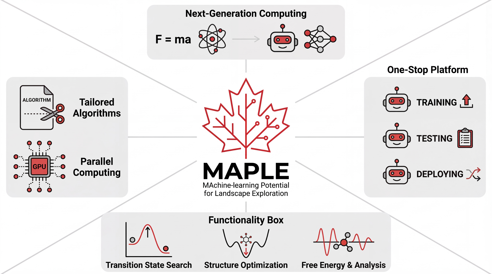

# **MA**chine-learning **P**otential for **L**andscape **E**xploration (**MAPLE**)



MAPLE is a machine-learning-potential-native computational chemistry toolkit for
geometry optimization, transition-state search, reaction-path analysis, molecular
dynamics, and related post-processing workflows.

## Core Capabilities

| Category | Methods |
|----------|---------|
| **Optimization** | L-BFGS, RFO, SD, CG, SD-CG, GDIIS |
| **Transition State** | NEB, CI-NEB, P-RFO, Dimer, String/GSM, AutoNEB |
| **Reaction Path** | IRC with GS, LQA, HPC, EulerPC |
| **Dynamics** | NVE, NVT, NPT |
| **Analysis** | Frequency, PES Scan, Single Point |
| **ML Potentials** | ANI, AIMNet2, MACE, MACEPol, UMA |
| **Extras** | D4 dispersion, explicit solvent cluster builder, experimental MACE-POLAR/SMD implicit-solvation correction, an explicitly acknowledged known-nonpassive MACE-POLAR-EF/smooth-PCM diagnostic, UMA/FAIR-Chem-backed PBC, restart files, DCD output |

## Installation

### Requirements

- Python >= 3.10
- CUDA-capable GPU recommended for production workloads

MAPLE separates dependencies into three groups:

| Group | Installed by `pip install -e .` | Purpose |
|-------|----------------------------------|---------|
| Core | Yes | Base MAPLE runtime and general scientific I/O |
| Optional tools | Only when explicitly requested | Plotting and development tools |
| External ML runtimes | No | User-selected PyTorch/CUDA and FAIR-Chem stacks |

Core dependencies declared by MAPLE:

| Package | Minimum version | Notes |
|---------|-----------------|-------|
| `ase` | `>=3.22` | Atomic structures, calculators, I/O |
| `numpy` | `>=1.20` | Numerical arrays |
| `scipy` | `>=1.7` | Scientific routines |

External runtime dependencies that users install manually:

| Package | Version boundary | Required for | Why MAPLE does not auto-install it |
|---------|------------------|--------------|------------------------------------|
| `torch` | `>=2.0` | ANI, AIMNet2, MACE-OFF, MACE-O-MOL, MACE-Polar, UMA | PyTorch wheels must match the user's CUDA/CPU runtime and should be selected from the official PyTorch index. |
| `mace-torch` | `==0.3.16` for Route 2 | Official MACE-POLAR-1-M density/field response | Route 2 pins the upstream graph-long-range API and uses the official model cache; MAPLE does not redistribute the ASL weights. |
| PCMSolver | v1.1.12-style C API | Route-2 SMD/IEFPCM | Install `libpcm.so` and its matching official Python parser externally; MAPLE does not bundle or build PCMSolver. |
| `fairchem-core` | FAIR-Chem release with UMA support; tested locally with `2.19.0` | UMA and FAIR-Chem-backed/PBC workflows | FAIR-Chem may impose its own compatible PyTorch/runtime constraints, so install it after the matching PyTorch wheel. |

Route-2 SMD additionally requires:

```bash
pip install 'mace-torch==0.3.16'
export PCMSOLVER_LIBRARY=/absolute/path/to/libpcm.so
export PCMSOLVER_PYTHON_PATH=/absolute/path/to/pcmsolver/lib/python
```

### Install MAPLE

```bash
git clone https://github.com/ClickFF/MAPLE.git
cd MAPLE
pip install -e .
```

### Install Dependencies

The `pip install -e .` command above installs only MAPLE's core dependencies.
Install PyTorch separately for your hardware. Examples:

```bash
# PyTorch example: CUDA 11.8
pip install torch --index-url https://download.pytorch.org/whl/cu118

# CPU-only PyTorch
pip install torch --index-url https://download.pytorch.org/whl/cpu
```

Install FAIR-Chem only if you need UMA or FAIR-Chem-backed/PBC workflows:

```bash
pip install fairchem-core
```

Model checkpoint boundary:

- MAPLE auto-downloads only the model files hosted at https://huggingface.co/Wayne7815/MAPLE_models.
- Auto-downloads use a pinned HuggingFace revision by default; set `MAPLE_MODEL_REVISION` only when intentionally refreshing model assets.
- Route-2 MACE-POLAR-1-M uses MACE's official `polar-1-m` download/cache path in float64. MAPLE does not bundle, mirror, modify, or silently replace that checkpoint.
- The local `macepol-ef-v2.pt` asset is accepted only by exact SHA-256 through
  an explicit `model_path`. Its sole implicit-solvent profile is a water-only,
  energy-only known-nonpassive diagnostic requiring
  `acknowledge_known_nonpassive=true`; it is not an accuracy or production
  capability.
- Other backend-specific or local checkpoints must be present in `maple/function/calculator/model/` or supplied through an explicit model path when that backend supports one.
- UMA checkpoints are resolved through an explicit path, a local `maple/function/calculator/model/uma-*.pt` file, or FAIR-Chem's official model-loading path.

PBC boundary:

- PBC support is currently available through UMA/FAIR-Chem-backed workflows only.
- ANI, AIMNet2, MACE-OFF, MACE-O-MOL, and MACE-Polar are molecular no-PBC wrappers in MAPLE and fail fast when periodic atoms are supplied.
- AIMNet2 `coulomb_method=ewald` is disabled until validated cell/PBC/MIC inputs and reference tests exist; use `simple` or `dsf`.
- UMA stress/virial requests are rejected until MAPLE validates stress-unit conversion.

## Quick Start

### Command Line

```bash
maple input.inp
maple input.inp output.out
maple --version
maple md nve
```

### Minimal Example

```text
#model=uma(size=uma-s-1p1)
#opt(method=lbfgs)
#device=gpu0

0 1
C   -0.748   0.014   0.025
C    0.748  -0.014  -0.025
O    1.170   0.016   1.330
H   -1.155  -0.888  -0.460
H   -1.096   0.888  -0.530
H   -1.155   0.049   1.065
H    1.148  -0.912   0.457
H    1.096   0.869   0.513
H    0.802   0.842   1.742
```
### External coordinates:
```
#model=uma(size=uma-s-1p1)
#opt(method=lbfgs)
#device=gpu0

XYZ 0 1 /path/to/molecule.xyz
```
TIPS:  Charge and spin multiplicity are supported only in the **OMOL task** mode of the **UMA** model and in the **AIMNet2 / AIMNet2-NSE** models.
## Input Overview

### Header Keywords

```text
#model=<model>
#<task>(options)
#device=<device>
```

### Common Tasks

| Header | Description |
|--------|-------------|
| `#opt(method=lbfgs)` | Geometry optimization |
| `#sp` | Single-point energy |
| `#ts(method=neb)` | Transition-state search |
| `#freq` | Frequency analysis |
| `#irc(method=gs)` | Intrinsic reaction coordinate |
| `#scan(method=lbfgs)` | PES scan |
| `#md(mdp=nvt.mdp)` | Molecular dynamics |

### UMA Options

`#model=uma(...)` accepts the following keys (all optional):

| Key | Values | Default | Notes |
|-----|--------|---------|-------|
| `size` | `uma-s-1p1`, `uma-s-1p2`, `uma-m-1p1` | `uma-s-1p1` | Checkpoint variant |
| `task` | `omol`, `omat`, `oc20`, `odac`, `omc`, `oc22`, `oc25` | `omol` for non-periodic systems | Periodic UMA requires an explicit periodic task such as `omat`, `oc20`, `oc22`, `oc25`, `omc`, or `odac` |
| `inference` | `default`, `turbo` | `default` | `turbo` accelerates fixed-composition GPU workloads (NEB / TS / freq); ignored on CPU |

### Coordinates

Inline coordinates:

```text
#model=uma(size=uma-s-1p1,task=omol,inference=default)
#sp
#device=gpu0

0 1
C   0.000   0.000   0.000
H   1.089   0.000   0.000
...
```

External coordinates:

```text
#model=uma(size=uma-s-1p1,task=omol,inference=default)
#sp
#device=gpu0

XYZ 0 1 /path/to/molecule.xyz
```

Multi-structure jobs such as NEB accept multiple `XYZ` records.<br>
TIPS:  Charge and spin multiplicity are supported only in the **OMOL task** mode of the **UMA** model

MAPLE supports custom explicit-solvent PDB templates; see the
[solvent documentation](https://www.maplechem.org/functions/solvent.html)
for usage guidance.

## Documentation

- Website: https://www.maplechem.org/
- Release history: https://github.com/ClickFF/MAPLE/releases
- Architecture notes: [ARCHITECTURE.md](ARCHITECTURE.md)
- Authoring a calculator backend: [maple/function/calculator/AUTHORING.md](maple/function/calculator/AUTHORING.md)

## Citation

```text
https://github.com/ClickFF/MAPLE
```

## Contributing

1. Fork the repository.
2. Create a feature branch.
3. Make changes with clear commits.
4. Open a pull request.

## Acknowledgments

- [ASE](https://wiki.fysik.dtu.dk/ase/)
- [PyTorch](https://pytorch.org/)
- [AIMNet2](https://github.com/isayevlab/AIMNet2)
- [FAIR-Chem](https://github.com/FAIR-Chem/fairchem)

**Version**: 0.1.4<br>
**Status**: Active Development<br>
**Updated**: May 2026<br>
